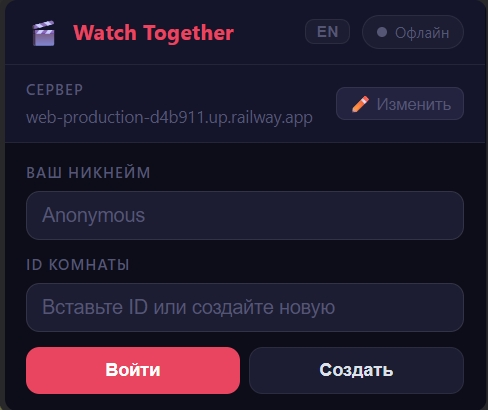

[🇬🇧 English](#english) · [🇷🇺 Русский](#russian)

---

<a name="english"></a>

# 🎬 Watch Together

> Browser extension for synchronized video watching on **any site** — YouTube, HDrezka, Kinopoisk, and more.

Watch the same video with a friend in real time: play, pause, seek, change playback speed, switch episodes, and chat — all perfectly in sync.

---

## Screenshots

| Join / Create room | Room panel |
|---|---|
|  |  |

---

## Features

- ▶️ Synchronized play / pause / seek
- ⚡ Playback speed sync (0.25× – 3×)
- 💬 In-room chat with bubble UI
- 👥 Participant list (highlights you)
- 📺 Episode / navigation sync with one-click suggestion banner
- 🌐 Works on any site with a `<video>` tag, including iframe-embedded players
- 🔌 Exponential backoff reconnect — stays connected automatically
- 🌍 EN / RU interface language toggle

---

## Installation

### Extension

1. Clone or download this repository.
2. Open Chrome (or any Chromium-based browser) and go to `chrome://extensions/`.
3. Enable **Developer mode** (toggle in top-right corner).
4. Click **Load unpacked** and select the `extension/` folder.

### Server

The extension needs a WebSocket server. You can host it for free or run it locally.

#### Option A — Railway (free tier)

1. Fork / push `server.js` + `package.json` to a new GitHub repo.
2. Go to [railway.app](https://railway.app), create a project → **Deploy from GitHub repo**.
3. Copy the generated URL (e.g. `wss://your-app.up.railway.app`).
4. Paste it into the extension popup → **Server** field.

#### Option B — Render (free tier)

1. Create an account at [render.com](https://render.com).
2. New → **Web Service** → connect your repo.
3. Build command: `npm install`, Start command: `node server.js`.
4. Copy the URL (e.g. `wss://your-app.onrender.com`).

#### Option C — Run locally

```bash
npm install
node server.js
# Server starts on port 3000
```

Set the server URL in the popup to `ws://localhost:3000`.

---

## How to use

1. Both you and your friend install the extension and set the **same server URL**.
2. Open a page with a video.
3. Click the extension icon.
4. **One person** clicks **Create** — a 6-character room ID is generated.
5. Share the room ID with your friend.
6. **Friend** pastes the ID and clicks **Join**.
7. The video is now fully synced. Use the **Chat** tab to communicate.

> **Tip:** The room state (time, playing, speed, current URL) is preserved on the server — a late joiner will be synced to the current position automatically.

---

## Project structure

```
sync-video/
├── server.js          # Node.js WebSocket server
├── package.json
└── extension/
    ├── manifest.json  # Manifest V3
    ├── background.js  # Service worker (auto-inject content script)
    ├── content.js     # Main sync logic, injected into every page/iframe
    ├── popup.html     # Extension popup UI
    ├── popup.js       # Popup logic + i18n
    └── screenshots/   # UI screenshots (for README)
```

---

## Requirements

- Node.js 18+
- Chrome 100+ (or any Chromium-based browser with Manifest V3 support)

---

## WebSocket protocol (summary)

| Direction | Event | Key fields |
|---|---|---|
| Client → Server | `join` | `room`, `username` |
| Client → Server | `play` / `pause` | `time` |
| Client → Server | `seek` | `time` |
| Client → Server | `speed` | `speed` |
| Client → Server | `chat` | `message` |
| Client → Server | `navigate` | `url`, `title` |
| Client → Server | `ping` | — |
| Server → Client | `room_joined` | `users`, `state` (time, playing, speed, url, title) |
| Server → Client | `user_joined` / `user_left` | `username`, `users` |
| Server → Client | `play` / `pause` / `seek` / `speed` | mirrored fields |
| Server → Client | `chat` | `username`, `message` |
| Server → Client | `navigate` | `url`, `title` |
| Server → Client | `pong` | — |

---

## License

MIT License

Copyright (c) 2025

Permission is hereby granted, free of charge, to any person obtaining a copy of this software and associated documentation files (the "Software"), to deal in the Software without restriction, including without limitation the rights to use, copy, modify, merge, publish, distribute, sublicense, and/or sell copies of the Software, and to permit persons to whom the Software is furnished to do so, subject to the following conditions:

The above copyright notice and this permission notice shall be included in all copies or substantial portions of the Software.

THE SOFTWARE IS PROVIDED "AS IS", WITHOUT WARRANTY OF ANY KIND, EXPRESS OR IMPLIED, INCLUDING BUT NOT LIMITED TO THE WARRANTIES OF MERCHANTABILITY, FITNESS FOR A PARTICULAR PURPOSE AND NONINFRINGEMENT. IN NO EVENT SHALL THE AUTHORS OR COPYRIGHT HOLDERS BE LIABLE FOR ANY CLAIM, DAMAGES OR OTHER LIABILITY, WHETHER IN AN ACTION OF CONTRACT, TORT OR OTHERWISE, ARISING FROM, OUT OF OR IN CONNECTION WITH THE SOFTWARE OR THE USE OR OTHER DEALINGS IN THE SOFTWARE.

---

<a name="russian"></a>

# 🎬 Watch Together

> Браузерное расширение для совместного просмотра видео на **любом сайте** — YouTube, HDrezka, Кинопоиск и других.

Смотрите одно видео с другом в реальном времени: воспроизведение, пауза, перемотка, смена скорости, переключение серий и чат — всё идеально синхронизировано.

---

## Скриншоты

| Создание / вход в комнату | Панель комнаты |
|---|---|
|  |  |

---

## Возможности

- ▶️ Синхронизация воспроизведения / паузы / перемотки
- ⚡ Синхронизация скорости воспроизведения (0.25× – 3×)
- 💬 Встроенный чат с пузырьковым интерфейсом
- 👥 Список участников (вы подсвечены отдельно)
- 📺 Синхронизация серий / навигации с баннером-предложением
- 🌐 Работает на любом сайте с тегом `<video>`, в том числе с iframe-плеерами
- 🔌 Автоматическое переподключение с экспоненциальной задержкой
- 🌍 Переключение языка интерфейса EN / RU

---

## Установка

### Расширение

1. Клонируйте или скачайте этот репозиторий.
2. Откройте Chrome (или другой Chromium-браузер) и перейдите на `chrome://extensions/`.
3. Включите **Режим разработчика** (переключатель в правом верхнем углу).
4. Нажмите **Загрузить распакованное** и выберите папку `extension/`.

### Сервер

Расширению нужен WebSocket-сервер. Можно хостить бесплатно или запустить локально.

#### Вариант A — Railway (бесплатный план)

1. Опубликуйте `server.js` + `package.json` в новый GitHub-репозиторий.
2. Перейдите на [railway.app](https://railway.app), создайте проект → **Deploy from GitHub repo**.
3. Скопируйте сгенерированный URL (например, `wss://your-app.up.railway.app`).
4. Вставьте его в попап расширения → поле **Сервер**.

#### Вариант B — Render (бесплатный план)

1. Создайте аккаунт на [render.com](https://render.com).
2. New → **Web Service** → подключите свой репозиторий.
3. Build command: `npm install`, Start command: `node server.js`.
4. Скопируйте URL (например, `wss://your-app.onrender.com`).

#### Вариант C — Локальный запуск

```bash
npm install
node server.js
# Сервер запустится на порту 3000
```

В попапе расширения укажите `ws://localhost:3000`.

---

## Как использовать

1. Вы и ваш друг устанавливаете расширение и указываете **одинаковый URL сервера**.
2. Откройте страницу с видео.
3. Нажмите иконку расширения.
4. **Один из вас** нажимает **Создать** — генерируется ID комнаты из 6 символов.
5. Поделитесь ID с другом.
6. **Друг** вставляет ID и нажимает **Войти**.
7. Видео синхронизировано. Используйте вкладку **Чат** для общения.

> **Совет:** Состояние комнаты (время, воспроизведение, скорость, текущий URL) хранится на сервере — опоздавший участник автоматически синхронизируется с текущей позицией.

---

## Структура проекта

```
sync-video/
├── server.js          # Node.js WebSocket-сервер
├── package.json
└── extension/
    ├── manifest.json  # Manifest V3
    ├── background.js  # Service worker (авто-внедрение content script)
    ├── content.js     # Основная логика синхронизации
    ├── popup.html     # UI попапа расширения
    ├── popup.js       # Логика попапа + i18n
    └── screenshots/   # Скриншоты интерфейса (для README)
```

---

## Требования

- Node.js 18+
- Chrome 100+ (или любой Chromium-браузер с поддержкой Manifest V3)

---

## Протокол WebSocket (краткий справочник)

| Направление | Событие | Ключевые поля |
|---|---|---|
| Клиент → Сервер | `join` | `room`, `username` |
| Клиент → Сервер | `play` / `pause` | `time` |
| Клиент → Сервер | `seek` | `time` |
| Клиент → Сервер | `speed` | `speed` |
| Клиент → Сервер | `chat` | `message` |
| Клиент → Сервер | `navigate` | `url`, `title` |
| Клиент → Сервер | `ping` | — |
| Сервер → Клиент | `room_joined` | `users`, `state` (time, playing, speed, url, title) |
| Сервер → Клиент | `user_joined` / `user_left` | `username`, `users` |
| Сервер → Клиент | `play` / `pause` / `seek` / `speed` | зеркальные поля |
| Сервер → Клиент | `chat` | `username`, `message` |
| Сервер → Клиент | `navigate` | `url`, `title` |
| Сервер → Клиент | `pong` | — |

---

## Лицензия

MIT License

Copyright (c) 2025

Данная лицензия разрешает лицам, получившим копию данного программного обеспечения и сопутствующей документации (в дальнейшем именуемых «Программное обеспечение»), безвозмездно использовать Программное обеспечение без ограничений, включая неограниченное право на использование, копирование, изменение, слияние, публикацию, распространение, сублицензирование и/или продажу копий Программного обеспечения, а также лицам, которым предоставляется данное Программное обеспечение, при соблюдении следующих условий:

Указанное выше уведомление об авторском праве и данное уведомление о разрешении должны быть включены во все копии или значимые части данного Программного обеспечения.

ДАННОЕ ПРОГРАММНОЕ ОБЕСПЕЧЕНИЕ ПРЕДОСТАВЛЯЕТСЯ «КАК ЕСТЬ», БЕЗ КАКИХ-ЛИБО ГАРАНТИЙ, ЯВНЫХ ИЛИ ПОДРАЗУМЕВАЕМЫХ, ВКЛЮЧАЯ, НО НЕ ОГРАНИЧИВАЯСЬ ГАРАНТИЯМИ ТОВАРНОЙ ПРИГОДНОСТИ, СООТВЕТСТВИЯ ПО ЕГО КОНКРЕТНОМУ НАЗНАЧЕНИЮ И ОТСУТСТВИЯ НАРУШЕНИЙ. НИ В КАКОМ СЛУЧАЕ АВТОРЫ ИЛИ ПРАВООБЛАДАТЕЛИ НЕ НЕСУТ ОТВЕТСТВЕННОСТИ ПО КАКИМ-ЛИБО ИСКАМ, ЗА УЩЕРБ ИЛИ ПО ИНЫМ ТРЕБОВАНИЯМ, В ТОМ ЧИСЛЕ ПРИ ДЕЙСТВИИ КОНТРАКТА, ДЕЛИКТЕ ИЛИ ИНЫМ ОБРАЗОМ, ВОЗНИКШИМ ИЗ, ИМЕЮЩИМ ПРИЧИНОЙ ИЛИ СВЯЗАННЫМ С ПРОГРАММНЫМ ОБЕСПЕЧЕНИЕМ ИЛИ ИСПОЛЬЗОВАНИЕМ ПРОГРАММНОГО ОБЕСПЕЧЕНИЯ ИЛИ ИНЫМИ ДЕЙСТВИЯМИ С ПРОГРАММНЫМ ОБЕСПЕЧЕНИЕМ.
